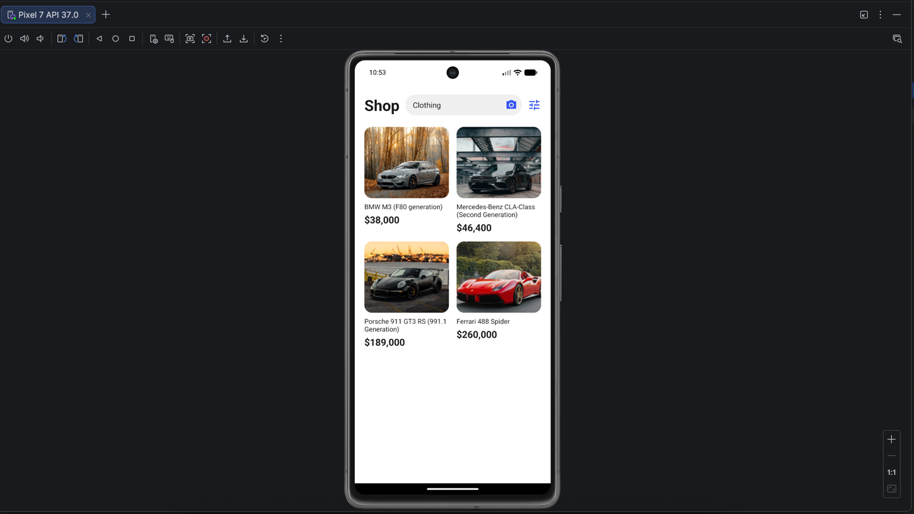
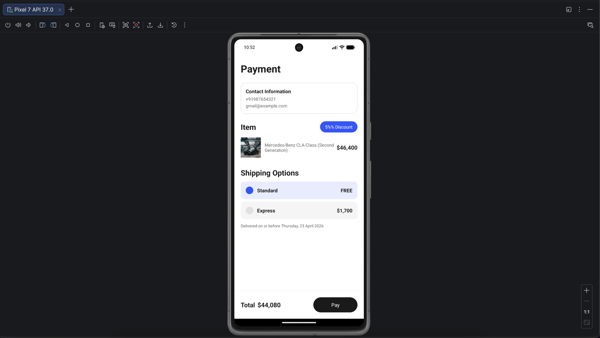
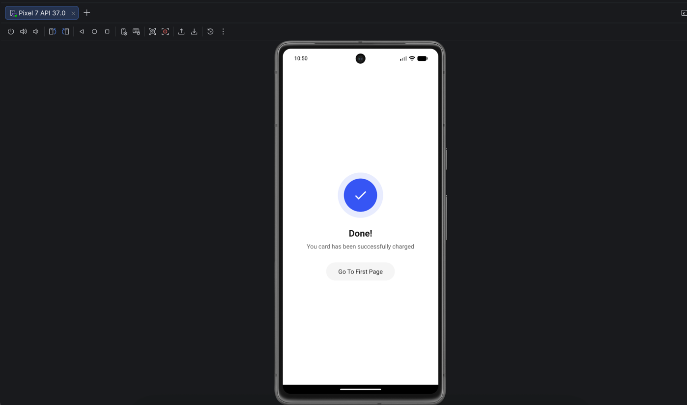

# Car Shop

Android application for browsing and purchasing luxury cars, built with Kotlin.

## Features

- **Product Selection** — browse 4 cars in a grid layout, tap to select
- **Payment & Calculation** — 5% automatic discount, Standard (free) or Express (+$1,700) shipping
- **Order Confirmation** — success screen with navigation back to shop

## Demo

<p>
  
  
  
</p>

## Cars Available

| Car | Price |
|---|---|
| BMW M3 (F80 generation) | $38,000 |
| Mercedes-Benz CLA-Class (Second Generation) | $46,400 |
| Porsche 911 GT3 RS (991.1 Generation) | $189,000 |
| Ferrari 488 Spider | $260,000 |

## Calculation Logic

```
discountedPrice = originalPrice * 0.95
total = discountedPrice + shippingCost
```

- Standard shipping: $0
- Express shipping: $1,700

## Tech Stack

- **Language:** Kotlin
- **Architecture:** 3 Activities with Intent-based navigation
- **UI:** XML layouts with Material Components
- **Min SDK:** 24 (Android 7.0)
- **Target SDK:** 34 (Android 14)

## Project Structure

```
app/src/main/
├── java/com/example/carshop/
│   ├── MainActivity.kt        # Shop page
│   ├── PaymentActivity.kt     # Payment & calculation
│   └── DoneActivity.kt        # Order confirmation
└── res/
    ├── layout/                 # XML layouts
    ├── drawable/               # Car images & shape drawables
    └── values/                 # Colors, strings, themes
```

## How to Run

1. Open the project in Android Studio
2. Sync Gradle
3. Run on emulator or device
